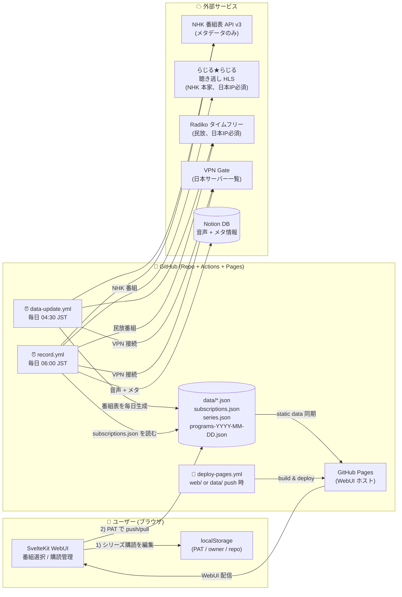
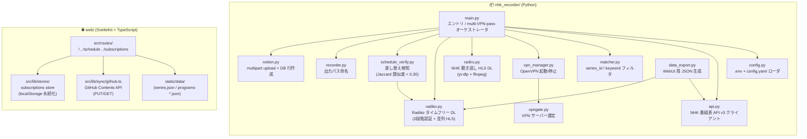
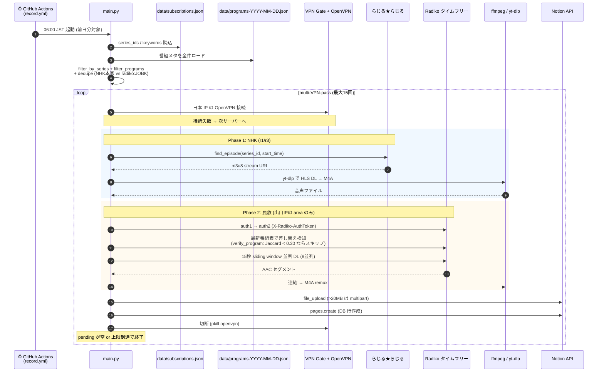
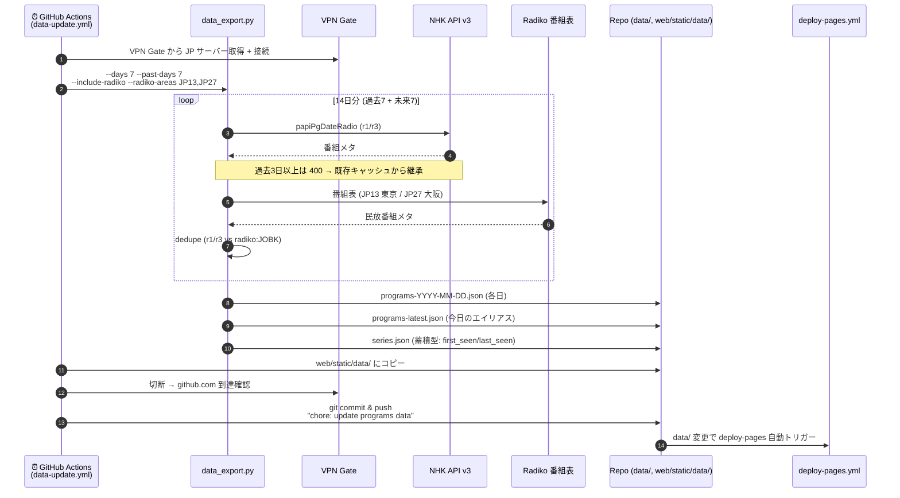
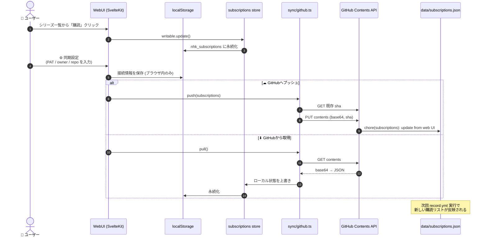

# NHK Radio Recorder

NHKラジオの番組表を取得し、キーワード(例: 落語/英語)にマッチする番組を自動録音してNotionデータベースにアップロードするツール。

## 機能

- NHK番組表API (v3) から全番組を取得
- **シリーズ購読方式**: 気になる番組を購読 → 毎週自動録音 (またはキーワード方式も可)
- ffmpegでHLS→M4A録音
- Notionデータベースに音声ファイル+メタ情報を自動アップロード
- Notionモバイルアプリから再生可能
- GitHub Actions + GitHub Pages で無料運用
- **モダンなWebUI (SvelteKit)** で番組選択・購読管理

## アーキテクチャ

このプロジェクトは「**ブラウザで購読を選び、GitHub Actions が代理で録音し、Notion に貯める**」という疎結合な3層構造で動く。
ローカル PC は不要で、サーバーも持たない (GitHub Pages + Actions + Notion で完結)。

### システム全体像



### コンポーネント責務マップ



### 録音実行フロー (`record.yml` / `python -m nhk_recorder`)

NHK は `radiru` 経由、民放は `radiko` 経由で取得元を**完全分離**する。
VPN を張り直して別 area の民放を取りに行く **multi-pass 方式** が核心。



### 番組データ更新フロー (`data-update.yml` / `python -m nhk_recorder.data_export`)

毎日早朝に番組表を再生成し、自動コミットする。WebUI が参照する static データはここで作られる。



### WebUI ↔ GitHub 同期フロー

ユーザーは PC を起動しなくてよい。ブラウザで購読を編集し、PAT 経由で `data/subscriptions.json` を直接コミットする。



### モジュール責務早見表

| レイヤ | モジュール / ファイル | 責務 | 主要な入出力 |
|---|---|---|---|
| CLI | [nhk_recorder/main.py](nhk_recorder/main.py) | エントリポイント・multi-VPN-pass オーケストレーション | CLI フラグ → 録音 → Notion |
| 設定 | [nhk_recorder/config.py](nhk_recorder/config.py) | `.env` + `config.yaml` ロード | 環境変数 → `Config` |
| メタ取得 | [nhk_recorder/api.py](nhk_recorder/api.py) | NHK 番組表 API v3 クライアント | date/service/area → `Program[]` |
| フィルタ | [nhk_recorder/matcher.py](nhk_recorder/matcher.py) | series_id / keyword マッチ | `Program[]` → 対象 `Program[]` |
| NHK 取得 | [nhk_recorder/radiru.py](nhk_recorder/radiru.py) | 聴き逃し HLS から M4A 取得 (yt-dlp 優先) | series_site_id + start_time → m4a |
| 民放 取得 | [nhk_recorder/radiko.py](nhk_recorder/radiko.py) | 2段階認証 + 並列 HLS タイムフリー DL | station_id + 時刻範囲 → m4a |
| 差し替え検知 | [nhk_recorder/schedule_verify.py](nhk_recorder/schedule_verify.py) | Radiko 最新表とキャッシュ比較 (Jaccard) | 録音前のスキップ判定 |
| VPN | [nhk_recorder/vpn_manager.py](nhk_recorder/vpn_manager.py) / [vpngate.py](nhk_recorder/vpngate.py) | OpenVPN 起動・停止、VPN Gate サーバー選定 | サーバーリスト → 接続/切断 |
| 録音 | [nhk_recorder/recorder.py](nhk_recorder/recorder.py) | 出力パス命名 (`YYYYMMDD_HHMM_service_area_title.m4a`) | `Program` → ファイルパス |
| アップロード | [nhk_recorder/notion.py](nhk_recorder/notion.py) | Notion file_upload (multipart) + DB 行作成 | m4a + メタ → DB ページ |
| WebUI 用 JSON | [nhk_recorder/data_export.py](nhk_recorder/data_export.py) | NHK + Radiko を結合し programs/series JSON 生成 | `data/*.json` |
| WebUI ルーティング | [web/src/routes/](web/src/routes/) | `/`, `/schedule`, `/subscriptions` ページ | SvelteKit SSG |
| WebUI 状態 | [web/src/lib/stores/](web/src/lib/stores/) | 購読 store (localStorage 永続化) | ブラウザ内永続化 |
| WebUI 同期 | [web/src/lib/sync/](web/src/lib/sync/) | GitHub Contents API クライアント | PAT で `subscriptions.json` PUT/GET |
| 録音 ワークフロー | [.github/workflows/record.yml](.github/workflows/record.yml) | 毎日 06:00 JST 録音実行 | 前日分の音声を Notion へ |
| データ ワークフロー | [.github/workflows/data-update.yml](.github/workflows/data-update.yml) | 毎日 04:30 JST 番組表更新 + 自動コミット | `data/` 配下 |
| デプロイ ワークフロー | [.github/workflows/deploy-pages.yml](.github/workflows/deploy-pages.yml) | `web/` or `data/` 変更で Pages デプロイ | GitHub Pages |

### データストア / スキーマ

| 場所 | 形式 | 生成主体 | 参照主体 |
|---|---|---|---|
| `data/subscriptions.json` | `{ series_ids[], keywords[] }` | WebUI (PAT 経由) / 手動 | `record.yml` |
| `data/programs-YYYY-MM-DD.json` | `{ date, area, programs[] }` | `data-update.yml` | `record.yml` / WebUI |
| `data/programs-latest.json` | 今日分のエイリアス | `data-update.yml` | WebUI トップ |
| `data/series.json` | 蓄積型シリーズ一覧 (`first_seen`/`last_seen`) | `data-update.yml` | WebUI 購読画面 |
| `recordings/` | `.m4a` (gitignore) | `record.yml` (一時) | アップロード後削除 |
| Notion DB | 番組名・チャンネル・放送日・時間帯・録音時間・キーワード・音声ファイル | `record.yml` | モバイル/Web の Notion |
| ブラウザ localStorage | `nhk_subscriptions` + GitHub 接続情報 | WebUI | WebUI |

### 設計上の重要ポイント

- **VPN は隔離コンテナ内で完結**: `radiru` の m3u8 (`vod-stream.nhk.jp`) も Radiko も日本 IP 必須。Nix で固定した OCI ランタイム内だけで OpenVPN の経路を変更し、Actions runner の制御通信と Git 操作はホスト経路に残す。
- **取得元の完全分離**: NHK は `radiru` のみ、民放は `radiko` のみ (Radiko の NHK 同時配信枠は配信停止アナウンスで上書きされる事故があるため、絶対に Radiko に落とさない)。
- **multi-VPN-pass による area カバー**: Radiko は出口 IP の area しか取れないため、別 VPN サーバー (= 別 area) で接続し直して未取得の局を順に拾う。1 ループで最大 15 回まで張り直す。
- **yt-dlp 優先 + ffmpeg フォールバック**: 長尺音楽番組などで ffmpeg の AAC デコーダが Multiple RDBs を扱えず途中停止する事故があるため、HLS は基本 yt-dlp の native downloader を使い、AES-128 復号には `pycryptodomex` が必須。
- **差し替え検知**: 早朝のキャッシュ (`programs-YYYY-MM-DD.json`) と録音直前の Radiko 最新表をタイトル文字 bigram の Jaccard 類似度で比較し、0.30 を下回ったら録音をスキップ (緊急特別番組・スポーツ延長を弾く)。回数マーカーは正規化で吸収。
- **サーバーレス購読同期**: 購読リストはブラウザの localStorage と GitHub リポジトリの 2 箇所のみ。中間サービス (DB / API サーバー) は不要。

## 必要なもの

- Nix (Python・ffmpeg・OpenVPN・開発ツールは `flake.lock` から提供)
- NHK APIキー (https://api-portal.nhk.or.jp/ で無料取得)
- Notion Integrationトークン (https://www.notion.so/profile/integrations で作成)

## ローカルセットアップ

```bash
# 1. 固定された開発環境へ入る
nix develop

# 2. 認証情報を設定
cp .env.example .env
# .env を編集して NHK_API_KEY / NOTION_TOKEN / NOTION_DATABASE_ID を記入

# 3. Notionデータベースに Integration を接続
# Notionでデータベースを開く → 右上「…」→「接続」→ あなたのIntegrationを選択

# 4. 動作確認 (録音せず対象番組だけ表示)
python -m nhk_recorder --subscriptions data/subscriptions.json --dry-run

# 5. タイムフリー録音を実行
python -m nhk_recorder --subscriptions data/subscriptions.json
```

## 設定

`.env`:
```bash
NHK_API_KEY=your_nhk_api_key
NOTION_TOKEN=ntn_your_notion_token
NOTION_DATABASE_ID=6dc536e3d4404708a92ef5554353fa0d
```

エリアコード・キーワード等の変更は `config.yaml` を作成:
```yaml
area: "270"           # 大阪 (130=東京, 230=名古屋 等)
services: [r1, r3]    # r1=AM, r3=FM
keywords: ["落語", "らくご", "英語"]
```

## GitHub Actions での自動実行 (推奨)

ローカルPCを動かし続けたくない場合の設定手順:

1. **リポジトリをGitHubにpush** (publicなら実行時間無制限)

2. **Secretsを登録**: Settings → Secrets and variables → Actions → New repository secret
   - `NHK_API_KEY`
   - `NOTION_TOKEN`
   - `NOTION_DATABASE_ID`

3. **動作確認**: Actionsタブ → "NHK Radio Recorder" → "Run workflow" で手動実行

これで毎日 06:00 JST に起動し、前日分（失敗時は翌日のフォールバック対象）を録音します。

録音対象は必須入力の `data/subscriptions.json`（シリーズ購読・キーワード方式）から
読みます。WebUI の「☁ GitHubへプッシュ」でこのファイルを更新できます。

## コマンド

| コマンド | 説明 |
|---|---|
| `python -m nhk_recorder --subscriptions data/subscriptions.json --dry-run` | 対象番組の確認のみ |
| `python -m nhk_recorder --subscriptions data/subscriptions.json` | 購読ベースで録音 (ローカルパス) |
| `python -m nhk_recorder --subscriptions https://.../subscriptions.json` | 購読ベースで録音 (URL 経由、SaaS 移行時用) |
| `python -m nhk_recorder --subscriptions data/subscriptions.json --target-date 2026-04-10` | 指定日の番組を対象にする |
| `python -m nhk_recorder.data_export` | 番組データJSONを生成 (Web UI用) |

## プロジェクト構成

```
001_radio/
├── .env                      # 認証情報 (gitignore)
├── .env.example
├── config.yaml.example
├── .github/workflows/
│   ├── record.yml            # 録音ワークフロー (毎日 06:00 JST)
│   ├── data-update.yml       # 番組データ更新 (毎日早朝)
│   └── deploy-pages.yml      # GitHub Pagesデプロイ
├── data/                     # 番組データ (GitHub Actionsが生成)
│   ├── series.json
│   ├── programs-YYYY-MM-DD.json
│   └── subscriptions.json    # 購読中シリーズID (手動orWebUIから配置)
├── nhk_recorder/
│   ├── main.py               # エントリーポイント
│   ├── config.py             # 設定ローダ(.env + config.yaml)
│   ├── api.py                # NHK番組表API v3 クライアント
│   ├── matcher.py            # キーワード/シリーズマッチング
│   ├── radiru.py             # NHK聴き逃し取得
│   ├── radiko.py             # Radikoタイムフリー取得
│   ├── vpn_manager.py        # 所有OpenVPNプロセスの管理
│   ├── vpngate.py            # VPN Gate設定取得・検証
│   ├── notion.py             # Notionアップロード
│   └── data_export.py        # Web UI向けJSON生成
├── web/                      # SvelteKit フロントエンド (GitHub Pages)
│   ├── src/routes/           # ページ
│   └── src/lib/              # コンポーネント/ストア
├── recordings/               # 録音ファイル出力先 (gitignore)
└── tests/
```

## Webフロントエンド (GitHub Pages)

SvelteKitで構築されたモダンなWebUI。シリーズ購読・番組閲覧が可能。

### ローカル開発
```bash
cd web
npm install
npm run dev  # http://localhost:5173
```

### GitHub Pages デプロイ
`main`ブランチに`web/`や`data/`をpushすると自動デプロイされます。

1. GitHub リポジトリ → Settings → Pages → Source を「GitHub Actions」に設定
2. 初回デプロイ後、`https://{username}.github.io/{repo-name}/` でアクセス可能

### 購読フロー

#### 推奨: WebUI から GitHub に直接同期
1. GitHub で **Fine-grained Personal Access Token** を発行
   - Settings → Developer settings → Personal access tokens → Fine-grained tokens
   - Repository access: このリポジトリを選択
   - Permissions: **Contents: Read and write**
2. Webサイトの「購読中」ページ → 「⚙ 同期設定」→ PAT / owner / repo を入力して保存
   (ブラウザの localStorage にのみ保存されます)
3. 気になる番組を「購読」
4. 「☁ GitHubへプッシュ」をクリック → `data/subscriptions.json` が自動コミットされる
5. 次回の GitHub Actions 実行時から、購読した番組が自動録音される

別のブラウザ/端末で購読を引き継ぐ場合は「⬇ GitHubから取得」でリモートの購読リストを読み込めます。

#### トラブルシューティング: 接続テスト
「☁ GitHubへプッシュ」が 403/404 で失敗する場合は、**⚙ 同期設定** パネルの
「🔍 接続テスト」ボタンを押してください。トークン認証 → リポジトリアクセス →
ブランチ確認 → ファイル確認の順に段階的に検証し、原因(トークン権限不足、
Fine-grained tokenのリポジトリ未選択など)を特定します。

## テスト

```bash
python -m pytest tests/ -v
```

## 取得元の使い分け: NHK は radiru、民放は Radiko

2026-04-14 のインシデント調査で、Radiko タイムフリーが **NHK の多くの番組を
「配信停止」扱い** にしていることが判明した。該当番組にアクセスすると
「大変申し訳ありませんが、現在お聞きいただいているこの番組は配信を停止して
おります」という 15 秒アナウンスが BGM 付きで番組時間全体にわたってループ
再生される (スケジュール・波形的には正常な録音に見える)。語学・音楽・海外
コンテンツを含む番組は特に対象になりやすい。

本ツールは以下のように取得元を完全に分離する:

| サービス | 取得元 | VPN | radiru に無い場合 |
|---|---|---|---|
| `r1` / `r3` (NHK 本家) | [らじる★らじる 聴き逃し](https://www.nhk.or.jp/radio/) | 不要 | **スキップ** (Radiko に落とさない) |
| `radiko:XXX` (民放) | Radiko タイムフリー | 必要 (日本 IP) | — |

- NHK 番組は `series_site_id` = NHK API v3 の `radioSeriesId` と同じなので
  既存の購読 ID がそのまま利用できる。
- radiru の配信期間は放送後 1 週間 (番組により変動)。
- **再放送枠の扱い**: radiru は再放送に個別エピソードを割り振らない
  (例: 名演奏ライブラリー 日曜 09:00 原放送のみ収録、火曜 16:00 再放送は無い)。
  この場合、同一シリーズ内で **タイトル完全一致** のエピソードを
  フォールバックとして採用する。音声は原放送エピソードから取得するが、
  Notion の `放送日`・`時間帯` は購読した枠 (火曜 16:00) のまま保存される。
  回数表記は厳密に比較するので `Lesson (9)` と `Lesson (10)` が誤マッチする
  ことはない。

## スケジュール差し替え防止 (schedule verification)

`programs-YYYY-MM-DD.json` は放送日の早朝 04:30 JST に一度だけ生成される
キャッシュのため、当日中に NHK / 民放が番組を差し替えた場合 (緊急特別番組・
スポーツ中継延長・追悼番組等) は反映されない。Radiko タイムフリーは
「実際に流れた音声」を返すので、そのまま録音するとメタデータ = 予定の番組・
音声 = 差し替え後の別番組というミスマッチが Notion に保存される。

この現象を防ぐため、録音直前に Radiko の最新番組表をクロスチェックして
キャッシュと類似度 (文字 bigram Jaccard) を比較し、閾値 (0.30) を下回る
差し替えを検知した場合は録音をスキップする。回数マーカー
(「第10回」「Lesson(10)」「（２）」など) は正規化で吸収するので、
シリーズの回数違いは誤検知されない。

- 無効化したい場合 (デバッグ等): `python -m nhk_recorder --no-verify-schedule ...`
- 過去日の JSON は `data_export` も上書き保存するようになったため、
  WebUI で過去の番組表を見たときも差し替え後のタイトルが表示される。

## 注意事項

- NHKラジオ第2 (r2) は2026年3月30日廃止。現在は r1(AM) と r3(FM) のみ
- NHK APIは1日300リクエスト制限
- 録音した音声は個人利用の範囲内でお使いください
- Notionファイルアップロードは有料プランで5GBまで

## SaaS 化への移行計画

将来のマルチユーザー化・SaaS 化については [`docs/saas-migration.md`](docs/saas-migration.md) を参照。
